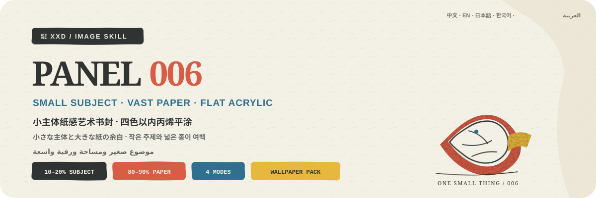

<p align="center">
  
</p>

<div align="center" dir="rtl">

# 🦁 XXD Panel 006

### يحوّل الصورة إلى غلاف كتاب فني بموضوع صغير ومساحة ورقية واسعة

[](./SKILL.md)
[](#أربعة-مخرجات-ومنطق-واحد-لغلاف-ورقي)
[](#الحدود-والثقة)

<a href="README.md">简体中文</a> · <a href="README.en.md">English</a> · <a href="README.ja.md">日本語</a> · <a href="README.ko.md">한국어</a> · <strong>العربية</strong>

</div>

<div dir="rtl">

> موضوع 10–20% · ورق 80–90% · خط يدوي رفيع · أربعة ألوان كحد أقصى · أكريليك مسطح

XXD Panel 006 مهارة لتوليد الصور مخصّصة لـ Codex والوكلاء المتوافقين. تحافظ على الهوية والحركة والوظيفة والعاطفة الحقيقية، ثم تختزل الموضوع جذرياً إلى رسم صغير ومركّز يشغل نحو 10–20% من مساحة التصميم. وتصبح النسبة الباقية، 80–90%، فراغاً فاعلاً من ورق أبيض خشن أو فاتح.

لا يبيّن الخط اليدوي الرفيع وغير المستقر قليلاً إلا البنية الضرورية، بينما تبني مساحات أكريليك قليلة وكاملة ومعتمة الموضوع. ولا تتجاوز الألوان الأساسية المشتقة من المصدر أربعة ألوان خارج لون الورق. أما النص فهو تركيب هادئ لغلاف كتاب فني يوازن الرسم الصغير عبر الفراغ، لا شعاراً ملصقاً عليه.

## لماذا توجد 006؟

يتحوّل «الرسم البسيط» بسهولة إلى أحد فشلين: رسم خطي بلا وزن، أو لوحة فارغة لا تربط الفراغ بالموضوع تركيبياً.

تعكس 006 هذا الترتيب:

```text
تثبيت حقائق المصدر ← اختزال الموضوع إلى رسم يشغل 10–20% ← جعل الورق الخشن 80–90% من الفضاء ← الإشارة إلى البنية بخط يدوي رفيع ← بناء الموضوع بمساحات أكريليك كاملة قليلة ← ضغط ألوان المصدر إلى أربعة أو أقل
```

إذا أمكن استبدال المصدر بصورة لا صلة لها من دون تغيير جوهري في محيط الرسم الصغير أو مساحاته اللونية الأساسية أو علاقته بالفراغ أو النص، فالنتيجة ليست 006.

## العقد البصري لـ 006

- **موضوع صغير عالي التعرّف:** يشغل الرسم نحو 10–20%، وتحفظ ثلاث علامات خاصة بالمصدر على الأقل الهوية والحركة والوظيفة والعاطفة.
- **الفراغ هو الفضاء:** يحمل الورق الأبيض أو الدافئ أو الفاتح الخشن بنسبة 80–90% المقياس والهدوء وطابع النشر.
- **لاتماثل منضبط:** يمكن أن يقترب الموضوع من أعلى الصفحة أو أسفلها أو جانبها أو حافتها، لكن موضعه يستجيب للوضعية والحركة واتجاه القراءة والنص.
- **خط رفيع غير مستقر قليلاً:** يبيّن البنية والحدود والوصلات والملمس والتعرّف فقط، ولا يصبح رسماً خطياً صرفاً أو ضجيجاً مرتجفاً.
- **أكريليك مسطح كامل:** تبني مساحات معتمة قليلة الموضوع وتحفظ ترسّب الطلاء وحبيبات الورق والحواف غير المنتظمة قليلاً.
- **أربعة ألوان كحد أقصى:** خارج لون الورق، لكل لون رئيسي مشتق من المصدر وظيفة تعريفية أو بنيوية.
- **أقل إشارة للبيئة:** بضعة خطوط قصيرة أو مساحة لونية واحدة؛ لا إعادة بناء للمشهد ولا ملء للفراغ.
- **نص غلاف كتاب:** عنوان قصير واحد وما لا يزيد على سطرين صغيرين يوازنان الرسم عبر الفراغ.

## النماذج · قريباً

يحتفظ المستودع بمجلد [`assets/examples/`](assets/examples/) للأعمال القادمة. لن يُضاف إلا عمل مكتمل بأسلوب 006 ومؤكد من صاحب المشروع؛ ولن تُستخدم منشورات أو صور من أساليب أخرى كعناصر مؤقتة.

ستعرض النماذج القادمة قدرة 006 على التكيف فقط، ولن تصبح موضوعاتها أو نسب الفراغ أو ألوانها أو نصوصها أو أبعادها مراجع للتوليد أو قيماً افتراضية.

## أربعة مخرجات ومنطق واحد لغلاف ورقي

يمكن اختيار نمط واحد أو عدة أنماط معاً. أجب بـ `1` أو `1+3` أو `1،2،4` أو `الكل`؛ تزيل المهارة التكرار وتنفّذ بالترتيب الرقمي من 1 إلى 4. يُسلَّم كل نمط مستقلاً داخل مجلد مهمة منفصل ولا يُجمع في لوحة عامة، ويُنتج خيار «الكل» سبعة ملفات PNG لكل مصدر: ملفاً لكل نمط عادي وأربع خلفيات. يمكن تسمية المقاس بحسب النمط في الرد نفسه، وتظل الأنماط العادية غير المسمّاة متكيفة مع المصدر. ويُشارك النص بين الأنماط المختارة افتراضياً مع إمكان تخصيصه لكل نمط.

| النمط | منطق المقاس | الناتج |
| --- | --- | --- |
| `top-bottom` | متكيف مع المصدر | الصورة كاملة في الأعلى ورسم 006 الورقي ذي الموضوع الصغير في الأسفل؛ يحتفظ اللوحان بالمقاس وينقسمان 50/50 بدقة |
| `left-right` | متكيف مع المصدر | الصورة كاملة في اليسار ورسم 006 الورقي ذي الموضوع الصغير في اليمين؛ يحتفظ اللوحان بالمقاس وينقسمان 50/50 بدقة |
| `design-only` | متكيف مع المصدر | التصميم المتحوّل وحده من دون ظهور الأصل؛ يحتفظ بنسبة المصدر وأبعاده |
| `wallpaper-pack` | أربعة مقاسات أجهزة | ملفات PNG منفصلة للهاتف وiPad والحاسوب وساعة الأطفال |

الأولوية هي: البكسلات الدقيقة التي يحددها المستخدم، ثم النسبة أو الوجهة، ثم التكيف مع المصدر في الأنماط العادية. نسبة 3:4 في ملف `006.md` كانت لوحة إبداعية أولى وليست قيمة افتراضية صامتة في المهارة الحالية.

تبقى المنطقة الفوتوغرافية في الأنماط المزدوجة وفية للأصل، مع تلوين تحريري محدود وتوسيع ضروري للبيئة فقط. في التصميم المنفرد والخلفيات تبقى الصورة دليلاً، لكنها لا تظهر في الناتج.

### حزمة الخلفيات: مترابطة أو مستقلة

لا تملك الحزمة مقاسات افتراضية صامتة. يمكن اختيار الإعداد الشائع: الهاتف `1440×3200`، وiPad `2048×2732`، والحاسوب `3840×2160`، والساعة `1024×1024`، أو تقديم مقاسات مخصصة ومسمّاة لكل جهاز.

- **حزمة مترابطة (موصى بها):** يُنشأ تصميم iPad المرجعي ويُعتمد أولاً، ثم تعيد الأجهزة الثلاثة الأخرى التكوين بالرجوع إلى الصورة الأصلية وإلى المرجع نفسه.
- **أربعة أعمال مستقلة:** يرجع كل جهاز إلى الصورة الأصلية وحدها، ويستكشف موضعاً مختلفاً للموضوع ونسبة الورق واختيار الألوان الأربعة وإشارة البيئة وتوازن النص.

الترابط لا يعني القص. تُولّد الملفات الأربعة وتُركّب وتُراجع منفصلة، من دون سلسلة مراجع متتابعة تسبب الانحراف.

## يجب أن يوازن النص الموضوع الصغير عبر الفراغ

قبل التوليد، اختر نصاً تلقائياً أو نصاً مخصصاً أو نتيجة بلا نص. عند وجود نص، حدّد اللغة أو المنطقة المستهدفة.

يستخلص النص التلقائي عنواناً أو كلمة موضوع أو اسم كائن أو عبارة قصيرة من الهوية أو الحركة المرئية أو الوظيفة أو العلاقة أو المكان المعروف أو معنى هادئ تؤيده الصورة. يرتبط بالموضوع نفسه ولا يستعمل شعراً مبهماً للتظاهر بالرقي.

العنوان الواحد هو الإعداد الافتراضي. لا تُضاف من صفر إلى ملاحظتين قصيرتين إلا حين تحملان معلومة حقيقية، ولا تُختلق أرقام أو سنوات أو إحداثيات أو ملصقات أرشيفية لمجرد إظهار الرقي.

يحافظ على النص النهائي الذي يقدمه المستخدم حرفياً. أما الاتجاه الإبداعي أو المسودة القابلة للتحرير فلا تُصقل إلا مع الحفاظ على الجمهور والهدف والكلمات الإلزامية والنبرة والدلالة.

تتبع اللغة الجمهور المقصود لا لغة الأمر:

```text
السوق أو الجمهور المستهدف > لغة الناتج المحددة > لغة التوجيه؛ وإذا غابت كلها يُسأل المستخدم قبل التوليد
```

تستخدم النسخة اليابانية يابانية طبيعية، والنسخة الكورية كورية طبيعية بمسافات صحيحة، والنسخة البريطانية إنجليزية بريطانية، وتستخدم العربية افتراضياً العربية الفصحى المعاصرة مع تركيب حقيقي من اليمين إلى اليسار. لا تستنتج المهارة الجنسية من الوجه أو الملابس أو المشهد أو اللافتات، ولا تستخدم نصاً أجنبياً زائفاً للزينة.

## الشيفرة تضبط الهندسة وتوليد الصور يصنع العمل

ينشئ نموذج الصور الموضوع الصغير بنسبة 10–20%، والورق بنسبة 80–90%، والخط اليدوي الرفيع، ومساحات الأكريليك الكاملة، ولوحة لا تتجاوز أربعة ألوان، وتوازن نص غلاف الكتاب. ولا يتولى `scripts/compose_panel.py` سوى تخطيط اللوحة والتركيب النقطي الدقيق بنسبة 50/50 وتثبيت المقاس والمراجعة؛ ولا يرسم العمل برمجياً.

```bash
python3 scripts/compose_panel.py --plan --layout top-bottom --source photo.png
python3 scripts/compose_panel.py --plan --layout left-right --size 2560x1440
python3 scripts/compose_panel.py --audit result.png --layout design-only --size 2048x2048
```

يتطلب التخطيط العلوي/السفلي الدقيق ارتفاعاً كلياً زوجياً، ويتطلب التخطيط الأيسر/الأيمن عرضاً كلياً زوجياً. لا تغيّر المهارة البكسلات المطلوبة بصمت.

## البدء

```bash
git clone https://github.com/nevertoday/xxd-panel-006.git
mkdir -p ~/.codex/skills
ln -s "$(pwd)/xxd-panel-006" ~/.codex/skills/xxd-panel-006
```

يمكن لمستخدمي Claude Code ربط المجلد نفسه بـ `~/.claude/skills/xxd-panel-006`. أعد تشغيل جلسة الوكيل بعد التثبيت.

```text
$xxd-panel-006
حوّل هذه الصورة إلى تكوين يسار/يمين، واستخرج العبارة من معناها، واكتبها بالعربية الفصحى المعاصرة.
```

يمكن أيضاً استدعاء المهارة بصورة وحدها. ستسأل أولاً عن نمط واحد أو عدة أنماط وعن إعداد النص في قائمة مرقمة متعددة الأسطر؛ ويسأل نمط الخلفيات أيضاً عن الترابط والمقاسات.

المواصفات الكاملة:

- [مسار عمل المهارة](SKILL.md)
- [التوجيه الصيني الكامل](references/xxd-panel-006-prompt.zh-CN.md)
- [التوجيه الإنجليزي الكامل](references/xxd-panel-006-prompt.en.md)
- [موجز الأسلوب الأصلي](references/006-source.md)

## الحدود والثقة

- تبقى كل صورة داخل مهمتها ولا تستعير موضوعاً أو لوناً أو نصاً أو تكويناً من مدخل آخر أو نتيجة قديمة أو نموذج.
- ينشئ كل استدعاء مجلد مهمة جديداً، حتى عند تكرار المصدر والمعلمات.
- النتائج ملفات PNG نقطية، وليست SVG أو HTML أو Canvas أو بديلاً مرسوماً برمجياً.
- لا يعرض جسر الصور المضبوط سوى حالة منزوعة التفاصيل، ولا يكشف المزوّد أو نقطة الاتصال أو الرؤوس أو بيانات الاعتماد أو التوجيه أو نص الاستجابة.
- يعيد كل نمط عادي مختار ملفاً واحداً، ويضيف اختيار `wallpaper-pack` أربع خلفيات مستقلة. يعيد خيار «الكل» سبعة ملفات PNG لكل مصدر داخل أربعة مجلدات أنماط متجاورة، ولا ينشئ لوحة تجميع أو عرضاً عاماً.

يحتاج التركيب المحلي إلى Python 3 وPillow. يستخدم الجسر الآمن `tomllib` في Python 3.11 أو أحدث. ويحتاج توليد الصور إلى قدرة نقطية مدمجة في الوكيل المضيف أو مسار نقطي متوافق ومضبوط مسبقاً.

## المستودع

```text
xxd-panel-006/
├── SKILL.md
├── README.md / README.en.md / README.ja.md / README.ko.md / README.ar.md
├── agents/openai.yaml
├── assets/banner.svg + examples/ (محجوز لنماذج محلية مستقبلية)
├── scripts/compose_panel.py + configured_imagegen.py
└── references/xxd-panel-006-prompt.zh-CN.md + xxd-panel-006-prompt.en.md + 006-source.md
```

## عن XXD

XXD هو الاختصار التجاري لاسم Xiaoxiaodong. أنشأ المشروع ويديره [@xiaoxiaodong01](https://x.com/xiaoxiaodong01).

## الدعم والعضوية

### استشارة متعمقة · 299 يواناً صينياً/ساعة

تبلغ تكلفة الاستشارة الفردية المتعمقة في استخدام Skills مقدار 299 يواناً صينياً في الساعة. للحجز، تواصل عبر رمز WeChat أدناه.

### مجموعة مستخدمي Xiaoxiaodong Skills · 99 يواناً صينياً

تتيح دفعة واحدة قدرها 99 يواناً الانضمام إلى مجموعة تبادل سير العمل ومناقشة الأعمال والدعم بين المستخدمين. ولا تشمل الاستشارة الفردية المحسوبة بالساعة.

### Knowledge Planet＋مكتبة توجيهات الأعضاء · 699 يواناً صينياً/سنة

[Knowledge Planet](https://wx.zsxq.com/group/15554814142882) و[مكتبة توجيهات XXD](https://vip.xiaoxiaodong.ai/) عضوية واحدة: **دفعة سنوية واحدة تفتح الخدمتين من دون شراء ثانٍ.**

1. اشترك عبر Knowledge Planet ثم تواصل عبر WeChat للحصول على رمز استبدال المكتبة.
2. اشترك عبر مكتبة التوجيهات ثم تواصل عبر WeChat للحصول على دعوة إلى Knowledge Planet.

<p align="center">
  <a href="https://xiaoxiaodong.pages.dev/assets/wechat-qr.png"></a>
</p>

<div align="center" dir="rtl">

**اجعل الموضوع صغيراً بقدر ما يكفي للتعرّف؛ ودع فراغ الورق يمنحه الأهمية.**

</div>

</div>

---

<div align="center" dir="rtl">
  <h2>☕ ادعم هذا المشروع مفتوح المصدر</h2>
  <p>إذا وفّر عليك المشروع وقتاً، فإن نجمة أو مشاركة أو فنجان قهوة يساعد في استمراره.</p>
  <table><tr><td align="center" width="240">
    <a href="https://github.com/nevertoday/zhongguo-traditional-colors/blob/main/docs/images/buy-me-a-coffee-qr.png?raw=true"></a><br>
    <strong>Buy me a coffee</strong><br><sub>امسح رمز QR أو افتحه لدعم Xiaoxiaodong</sub>
  </td></tr></table>
  <p><sub>الدعم اختياري تماماً ولا يغيّر حق الوصول إلى هذا المشروع مفتوح المصدر.</sub></p>
</div>
